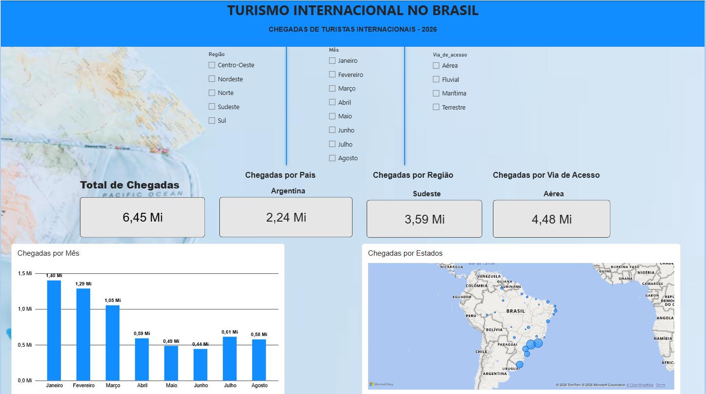

🌎 RPA + Power BI — Turismo Internacional no Brasil

Projeto de automação RPA desenvolvido em Python para coleta, atualização e organização de dados de turismo internacional, integrado a um dashboard interativo desenvolvido no Power BI.

📊 Sobre o projeto

O projeto tem como objetivo automatizar parte do processo de atualização de um dashboard de análise de dados.

A automação utiliza Python e PyAutoGUI para acessar a fonte de dados, realizar o download da base atualizada, organizar o arquivo e disponibilizá-lo para utilização no Power BI.

O dashboard permite analisar a chegada de turistas internacionais ao Brasil através de diferentes indicadores e filtros.

## 🤖 Automação RPA

O processo automatizado segue as seguintes etapas:

1. Acessar o portal de dados públicos;
2. Localizar e baixar a base de dados atualizada;
3. Localizar automaticamente o arquivo baixado;
4. Copiar o arquivo para a pasta do projeto;
5. Substituir a base anterior;
6. Abrir o Power BI;
7. Atualizar os dados do dashboard.

Fluxo da automação
      ↓
Portal de dados
      ↓
Download da base
      ↓
Localização do arquivo
      ↓
Cópia e substituição da base
      ↓
Abertura do Power BI
      ↓
Atualização dos dados
      ↓
Dashboard atualizado
